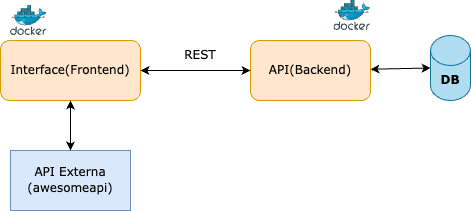

# 💱 FinanTrack – Simulador de Conversão de Moedas 

O **FinanTrack** é uma aplicação web que permite simular a conversão de valores em reais (BRL) para moedas estrangeiras como **Dólar (USD)**, **Euro (EUR)** e **Bitcoin (BTC)**. O sistema utiliza **cotações em tempo real** através de uma API externa e permite salvar, editar e excluir simulações realizadas. Também é possível visualizar a evolução das moedas em um **gráfico de histórico de cotações**.

Este repositório representa o **módulo principal** do projeto, contendo o front-end e os arquivos de orquestração `docker-compose.yml` e `docker-compose.override.yml`.

---

## 🧱 Arquitetura do Projeto

A arquitetura é baseada em **componentização e comunicação entre serviços REST**, organizada em dois módulos principais:

- **Frontend** (React + Axios) – Interface do usuário e ponto central de execução.
- **Backend** (FastAPI + SQLite) – API REST que gerencia simulações e dados persistidos.
- **API Externa** – AwesomeAPI para cotações atualizadas.




---

## 📁 Estrutura Recomendada

```
FinanTrack/
├── finantrack-frontend/             # Repositório principal (este)
│   ├── src/
│   ├── public/
│   ├── Dockerfile
│   ├── docker-compose.yml
│   ├── docker-compose.override.yml
│   └── README.md
│
├── finantrack-backend/             # Repositório auxiliar (API)
│   ├── app.py
│   ├── model/
│   ├── schemas/
│   ├── Dockerfile
│   └── requirements.txt
```

---

## 🚀 Como Executar o Projeto

### ✅ Pré-requisitos

- Docker + Docker Compose
- Git

### Passos:

1. Clone os dois repositórios lado a lado:

```bash
git clone https://github.com/seu-usuario/finantrack-frontend.git
git clone https://github.com/seu-usuario/finantrack-backend.git
```

2. Acesse a pasta do frontend:

```bash
cd finantrack-frontend
```

3. Execute o projeto:

```bash
docker-compose up --build
```

4. Acesse em seu navegador:

- 🌐 Interface Web: http://localhost:3000  
- 📘 Documentação da API: http://localhost:8000/docs

---

## 🧪 Funcionalidades

- ✅ Conversão de BRL para USD, EUR e BTC com cotações reais
- ✅ Persistência das simulações em banco de dados
- ✅ Edição e exclusão de simulações
- ✅ Gráfico de linha com histórico de cotações
- ✅ Máscara de entrada monetária (R$)
- ✅ Filtro de simulações por moeda
- ✅ Interface responsiva com visual moderno

---

## 🐳 Serviços e Portas

| Serviço   | Porta local | Descrição                          |
|-----------|-------------|--------------------------------------|
| frontend  | `3000`      | Interface web em React               |
| backend   | `8000`      | API REST com FastAPI + SQLite        |

---

## 📝 Licença

Este projeto está licenciado sob a Licença MIT. Veja o arquivo [LICENSE](./LICENSE) para mais informações.

---

## **Pós-Graduação em Engenharia de Software da PUC-Rio**.
- Disciplina: **Arquitetura de Software**
- Desenvolvido por **Fábio Araújo**  
📧 Email: fabiorodrigo.puc@gmail.com


